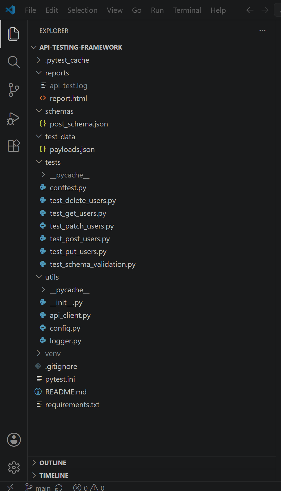
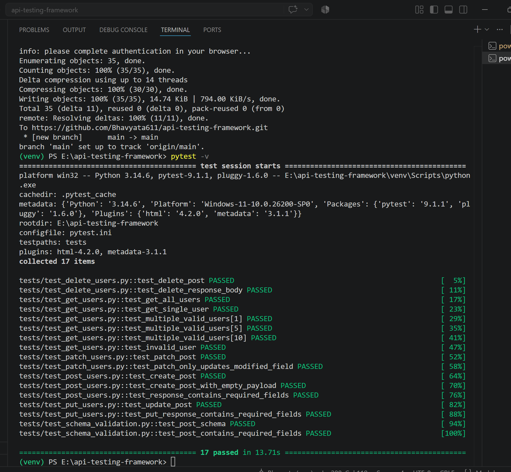
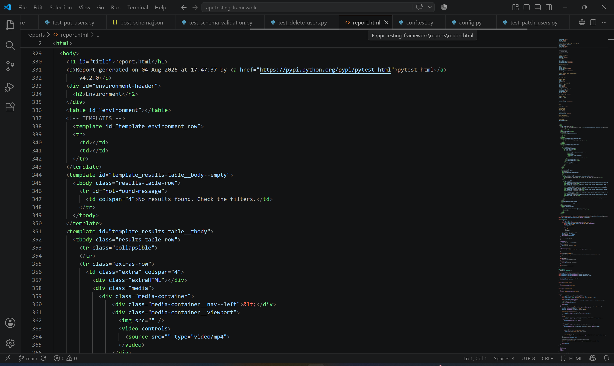

# API Testing Automation Framework

## Overview

A reusable API Testing Automation Framework built using **Python**, **Requests**, and **Pytest** to automate REST API testing. The framework validates REST API functionality through status codes, response headers, response body, response time, and JSON Schema validation. It follows a modular and maintainable structure using reusable utilities, fixtures, and external test data.

---

## Technologies Used

- Python
- Requests
- Pytest
- JSON Schema
- pytest-html
- Git

---

## Features

- Reusable API Client
- Automated REST API Testing
- GET Request Testing
- POST Request Testing
- PUT Request Testing
- PATCH Request Testing
- DELETE Request Testing
- Positive & Negative Test Scenarios
- Parameterized Tests
- Status Code Validation
- Response Header Validation
- Response Body Validation
- Response Time Validation
- JSON Schema Validation
- HTML Report Generation
- Logging Support
- Pytest Fixtures
- External Test Data Management
- Centralized Configuration

---

## Project Structure

```text
api-testing-framework/
│
├── tests/
│   ├── conftest.py
│   ├── test_get_users.py
│   ├── test_post_users.py
│   ├── test_put_users.py
│   ├── test_patch_users.py
│   ├── test_delete_users.py
│   └── test_schema_validation.py
│
├── test_data/
│   └── payloads.json
│
├── utils/
│   ├── __init__.py
│   ├── api_client.py
│   ├── config.py
│   └── logger.py
│
├── schemas/
│   └── post_schema.json
│
├── reports/
│   ├── report.html
│   └── api_test.log
│
├── requirements.txt
├── pytest.ini
├── README.md
└── .gitignore
```

---

## Public API Used

**JSONPlaceholder**

https://jsonplaceholder.typicode.com/

---

## Test Coverage

| HTTP Method | Test Scenarios |
|-------------|----------------|
| GET | Get all users, Get single user, Multiple users, Invalid user |
| POST | Valid payload, Empty payload, Response validation |
| PUT | Update resource, Response validation |
| PATCH | Partial update, Modified field validation |
| DELETE | Delete resource, Response validation |
| JSON Schema | Schema validation, Required fields validation |

**Total Automated Test Cases:** **17**

---

## Validations Performed

- HTTP Status Code Validation
- Response Header Validation
- Response Body Validation
- Response Time Validation
- JSON Schema Validation

---

## Installation

Clone the repository

```bash
git clone <repository-url>
```

Navigate to the project

```bash
cd api-testing-framework
```

Create a virtual environment

```bash
python -m venv venv
```

Activate the virtual environment (Windows)

```bash
venv\Scripts\activate
```

Install dependencies

```bash
pip install -r requirements.txt
```

---

## Run Tests

Execute all test cases

```bash
pytest -v
```

Generate HTML Report

```bash
pytest --html=reports/report.html --self-contained-html
```

---

## Sample Output

```text
=============================
collected 17 items

17 passed
=============================
```

---
## Screenshots

### Project Structure

 

### Test Execution

 

### HTML Report



## Reports

- HTML Test Report (`reports/report.html`)
- Execution Log (`reports/api_test.log`)

---

## Future Enhancements

- Authentication Testing
- Data-Driven Testing using Excel/CSV
- Environment Variables (.env)
- GitHub Actions CI/CD
- Docker Support
- Parallel Test Execution
- API Mocking

---

## Author

**Bhavyata Suthar**

Aspiring QA Engineer with hands-on experience in Manual Testing, API Testing, Security Testing, and Python Automation.
